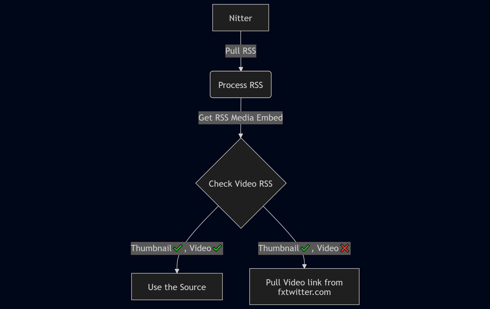
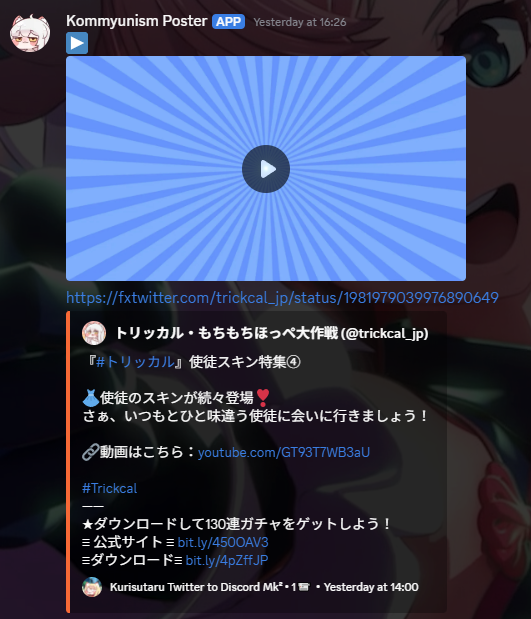

[](https://opensource.org/licenses/MIT)

# ~~Twitter~~ Nitter RSS Feed to Discord

This project enables the pooling of data from a Nitter RSS feed sourced from a public (or private) Nitter Instance and forwards it to a Discord Webhook Embed. By utilizing this system, you can keep your Discord community updated with the latest tweets from a specific Twitter account without directly interacting with the platform.

## Changelogs

- [Added] **RSS Video Fallback System**: When Nitter RSS includes a video thumbnail but **no video URL**, the script now pulls the video from **fxtwitter.com** to ensure full embed support in Discord. Includes detailed flowchart.
- [Added] Config switch to not generate my own embed implementation, also replacing the posted link with something else (like fxtwitter.com), or keep it blank if you don't want to change. .
- Config switch to not generate my own embed implementation, also replacing the posted link with something else (like fxtwitter.com), or keep it blank if you don't want to change.
- Now supports multiple webhooks and multiple user mentions.
- Revamped core code (mostly taken from my other project).

## RSS Video Check Flowchart


The script pulls tweets via Nitter's RSS feed. However, **Nitter sometimes includes a video thumbnail but no video URL** in the RSS — even though the video plays fine on the Nitter web interface.

To fix this, the script checks:
- **Thumbnail + Video** → Use Nitter source directly
- **Thumbnail only (no Video)** → Pull video metadata from **fxtwitter.com**

This ensures videos are always included in Discord embeds, even when Nitter's RSS is incomplete.



I use the **TweetShift** method to embed the video URL first (followed by the tweet), since `set_video()` are not supported in Discord webhooks.

I *would* prefer uploading videos directly to Discord for long-term preservation (like images), but file size limits and lack of webhook support make it impractical. The **TweetShift + fxtwitter fallback** remains the most reliable solution.

## Table of Contents

- [Introduction](#introduction)
- [Requirements](#requirements)
- [Installation](#installation)
- [Configuration](#configuration)
- [Usage](#usage)
- [Contributing](#contributing)
- [License](LICENSE)

## Introduction

Twitter provides RSS feeds for user timelines, but these feeds have been deprecated. Instead, this project leverages Nitter, a privacy-friendly and open-source alternative front-end for Twitter. The Nitter Instance offers RSS feeds for Twitter user timelines, which allows us to collect and process tweets.

The integration with Discord Webhook Embeds ensures that tweets are presented in an attractive and user-friendly format within your Discord server. This setup is particularly useful for community managers, content curators, or anyone interested in tracking specific Twitter accounts within their Discord community.

## Requirements

Before setting up this project, you need to have the following prerequisites:

- Python (version 3.11 or higher)
- Discord account and access to a Discord server with the "Manage Webhooks" permission
- Twitter account (for the target user timeline you want to track)
- Nitter Instance URL (public instance or self-hosted)
- Internet connectivity to fetch data from Nitter RSS feeds and post to a Discord webhook

## Installation

To get started, follow these steps:

1. Clone this repository to your local machine.
2. Install the required Python dependencies by running:

```bash
uv sync
``` 

or

```bash
pip install -r requirements.txt
``` 

## Configuration

Before running the script, you need to configure some settings:

1. Open `kuri.config.json` in your preferred text editor.
2. Set the Nitter instance URL in the `nitterServer` variable. Ensure that the Nitter server serves RSS feeds.
3. Enter the respective Twitter account URL in the `twitterWatch` variable.
4. Specify the Twitter handle of the user whose timeline you want to track in the `twitterHandleName` variable.
5. Adjust any other optional settings to customize the behavior of the script.

## Usage

Once you have completed the installation and configuration, you can run the script:

```bash
python kuri.py
```

or

```bash
uv run kuri.py
```

The script will start fetching tweets from the specified Twitter user's timeline RSS feed through the Nitter Instance and post them to the configured Discord Webhook. Each tweet will be displayed as an attractive Embed, providing essential information like the tweet content, date, and user details.

It is recommended to automate the script execution using tools like cron (Linux) or Task Scheduler (Windows) to keep the Discord channel updated regularly.

## Contributing

We welcome and appreciate contributions to this project! If you want to contribute, please follow these steps:

1. Fork the repository on GitHub.
2. Create a new branch from the main branch to work on your changes.
3. Make your changes, whether they are bug fixes, feature enhancements, or documentation improvements.
4. Commit your changes with descriptive commit messages.
5. Push the changes to your forked repository.
6. Create a pull request (PR) to the original repository, detailing your changes and explaining the purpose of the PR.

By contributing to this project, you agree to license your contributions under the same [MIT License](LICENSE) as the rest of the project.

I appreciate your efforts and will review your contributions as soon as possible. Thank you for making this project better!